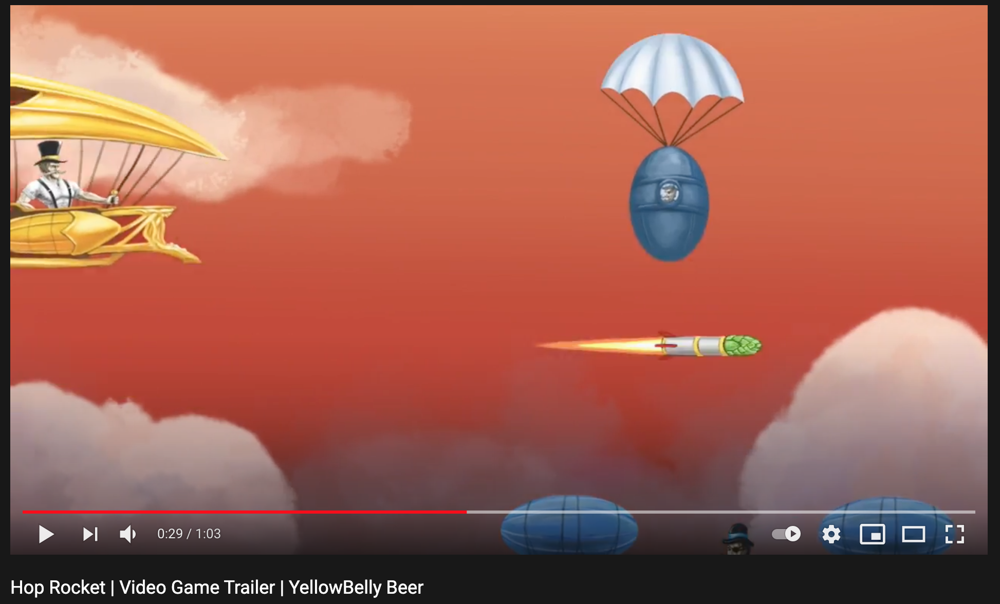
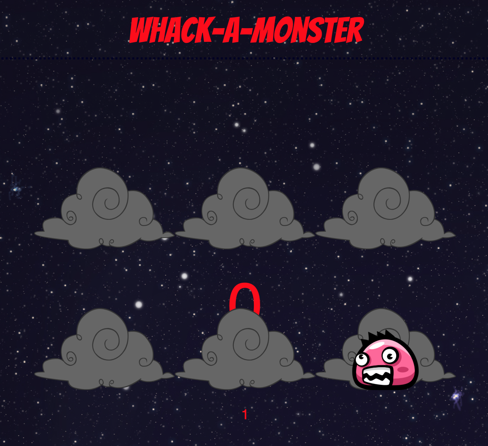
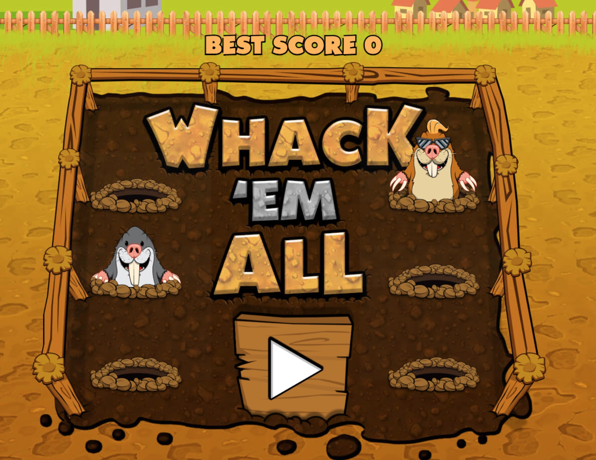

# Space Ambush

[Space Ambush](https://daithishan.github.io/milestoneproject1/) is a whack-a-mole type game with a sci-fi twist. It has been designed to offer new challenges to retro-arcade game, and flow quickly from one section to the next for brief bursts of play. It's responsive across different devices.

The game colors are vibrant and bright, the music fits the alien world and both combine to provide stimulation and immersion.

Space Ambush was built with HTML, CSS and Javascript and is an experimental form of rich content for younger supporters of The Mater Foundation, the charity for which I work as a digital fundraiser.

## Demo

A live demo of the website can be found here (https://daithishan.github.io/milestoneproject1/).

**[Live demo](https://daithishan.github.io/milestoneproject1/)**

## README Index
---

<span id="top"></span>

## Index

- <a href="#context">Context</a>
- <a href="#project-goals">Project Goals</a>
- <a href="#ux">User Experience</a>
- <a href="#ux-stories">User stories</a>
- <a href="#design">Design</a>
  - <a href="#inspiration">Inspiration</a>
  - <a href="#color">Color Scheme</a>
  - <a href="#type">Typography</a>
  - <a href="#imagery">Imagery</a>  
- <a href="#wireframes">Wireframes</a>
- <a href="#features">Features</a>
  - <a href="#features-current">Current</a>
  - <a href="#features-future">Future</a>
- <a href="#testing">Testing</a>
  - <a href="#code-validation">Current</a>
  - <a href="#manual-testing">Future</a>
- <a href="#credits">Credits</a>

---

<span id="context"></span>

## Context

Space Ambush is a mini game developed for marketing purposes. I developed it as an experimental way of developing new content for the younger supporters of The Mater Foundation, the charity for which I work in digital fundraising.

It's based off the retro-arcade game Whack-A-Mole, but I've tried to add a challenging twist for that game, while adding bright colours, synth and short play bursts.

---

<span id="project-goals"></span>

## Project Goals

1. To positively engage and entertain the younger subscriber list of The Mater Foundation with something unexpected.

2. To generate donations for The Mater Foundation through new and return visits to this mini game, Space Ambush.

<div align="right"><a style="text-align:right" href="#top">Return to index </a></div>

## User Experience (UX)
<span id="ux"></span>
### Overview

Space Ambush has been designed for quick play, while using local storage for repeat visits. The idea is also to funnel players towards The Mater Foundation's donation form.

- Mobile-first
- Streamlined
- Intuitive navigation
- Intuitive controls
- Continuous feedback
- Replayability

### User Stories

-   #### As a first time visitor, I want to:

1. See an appealing landing page, with clear, quick pathway to gameplay
2. Quickly learn the controls, and how to toggle audio and quick exit
3. Intuitively grasp the scoring system, and understand how I win and lose points

-  #### As a returning visitor, I want to:

1. See my old score and beat it
2. Choose higher difficulties, and experience genuinely harder gameplay
3. Have an option to contact developers for any bugs, or for other feedback

-  #### As the charity benefiting from this mini game, I want to 

1. Tie the game's premise to the charity mission after playthrough, without boring the player
2. Drive donations from players through the official charity website
3. Capture useful feedback including bug reports and feature suggestions

<div align="right"><a style="text-align:right" href="#top">Return to index </a></div>

### Design
<span id="design"></span>

#### Project Inspiration
<span id="inspiration"></span>

#### Branded Minigames

A conceptual inspiration for this mini game is from an Irish beer company that developed a video game as part of their marketing. The company is called Yellowbelly Beer, and the game is called [Hop Rocket](https://www.youtube.com/watch?v=i7G-gFBJzVk)



While this game is no longer available for play, I thought it was an interesting way of engaging a customerbase.

#### Dovile Krasnickaite - Whack-A-Monster

The other major inspiration for this project was from a fellow student from the Code Institute diploma. Their name is Dovile Krasnickaite, and their project was similarly based on the Whack-A-Mole game.



Their project showed how design and music could revitalise a game from 1970s arcades.

#### Memory Improvement Tips - Whack-Em-All

A further inspiration came from Memory Improvement Tips and their version of Whack-A-Mole, especially in terms of adding a new twist where the moles can fight back.



I also loved how they introduce a penalty click with the mole-bomb, which I didn't have time to introduce. I also liked how they pressured the user to make choices between different, simultaneously appearing moles. Cognitive overload makes the simple concept of Whack-A-Mole more difficult than a pure reflex test.


#### Color Scheme
<span id="color"></span>

- The theme of the game is futuristic, alien fun and quick reflexes. So the color palette includes bright, vibrant colors to promote light entertainment and good eye-hand coordination.

##### Space Ambush - Planet Colors:

-  #a8fffd (Celeste Blue)
-  #ffffff (White)
-  #ff55dd (Pizzazz Purple)
-  #668286 (Steel Teal)

##### Space Ambush - Monster One Colors:

-  #a8fffd (Aqua Blue)
-  #ffff00 (Lemon Glacier)
-  #ff6464(Bittersweet)

##### Space Ambush - Monster Two Colors:

-  #1eefba (Sea Green Crayola)
-  #ffde00 (Yellow Pantone)
-  #be0000(International Orange Engineering)

The Space Ambush color palette listed above is derived from digital assets designed by artist Robert Brooks, and purchased with Pro License on https://www.gamedevmarket.net

#### Typography
<span id="type"></span>
- Roboto Slab is the main body font used throughout the website, with Sans-Serif as the fallback font. The thick cut, futuristic design helps create the setting for this arcade-based, space game.

- Exo 2 is used for headings, and is similarly a thick cut, futuristic font. Perfect for a slightly retro-arcade, space game feel!

#### Imagery
<span id="imagery"></span>

- All digital assets used were originally designed by Robert Brooks, and purchased with Pro Liense on https://www.gamedevmarket.net

- These assets have been revised in Adobe Illustrator by me to remove their initial sideways-scrolling left-facing design, and to provide Whack-A-Mole style animations!

<div class="text-align:right"><a style="text-align:right" href="#top">Return to index </a></div>

### Wireframes
<span id="wireframes"></span>


https://www.figma.com/file/EOkhXQoglVdZMW3VcIozuy/Mater-Mini-Game?node-id=59%3A0

<div class="text-align:right"><a style="text-align:right" href="#top">Return to index </a></div>

## Features
<span id="feature"></span>

### Current
<span id="features-current"></span>


**1. Modal Menus**

| Menu Type  | Description                                                                                                                                                                                                         |
| :------ | :------------------------------------------------------------------------------------------------------------------------------------------------------------------------------------------------------------------ |
| Main Menu | Provides access to level selection and gameplay, audio options and contact form                                                                                                                                     |
| Level Selection | Provides options between easy and hard which will determine gameplay                                                                                                                                              |
| Audio | Provides volume choice using sliders, with immediate feedback on sound levels                                                                                                                                             |
| Game Over  | Displays score, all time high score and a prompt for donation to Mater Foundation

**2. Level Selection**

- Space Ambush can be played in easy or hard mode.
    * In easy mode, players must click or tap a randomly appearing monster to win points. If they don't act quickly, the alien turns red and attacks them, losing them points.

    * In hard mode, players are in double trouble. They face two aliens that both have a random chance of turning red and attacking them. It's harder to win points, as the aliens appear in quick succession, which is confusing.

**3. Game Area**

- The game area has a responsive design which will adapt to the user's device dimensions.

- The ingame controls on the top are also responsive, and will display differently on wide screens vs mobile screens.

- The layout of the alien plants is also responsive and will vary slightly on wide screens vs mobile screens to offer the best type of game play on each.

**4. Alien Ambushers**

- When the user starts the game, they will immediately be ambushed by aliens.

- The number of aliens ambushing at any time is controlled by the difficulty setting.

- The user will have a randomized time window in which to zap the aliens by clicking on them. But the aliens have a randomized probability of also attacking the user.

- When the user successfully attacks, they'll gain points. When the alien attacks, the user will lose points.

**5. Timer and Score**

- When the user starts the game, there is an active timer that immediately triggers and continues counting down to game end. 

- A score and high score also appears on entry. A user earns points by attacking the aliens before they hid behind the plants, and loses points when the alien turns red and attacks them.

- High score is saved and pulled from local storage.

**6. Visual Feedback**

- Every time a player makes a menu choice, clicks on an alien monster, or fails to click on a monster in time a visual effect is programmed as a result. Monsters turn red when they attack, and yellow when they're hit, and a modal generates when the game is over. At every stage of user experience, visual effects are used to give feedback.

**5. Audio**

- The game has four types of audio; a lasergun click sound, a short gameplay audio clip, a longer menu music audio clip and a game over laser cannon effect.

- The user can set the volume of the sound effects (lasergun, laser cannon) and the music (game music, menu music) using sliders. The user can also toggle on and off the game music in the game.

**6. Responsive/Intuitive Input**

- The game can be controlled with either a mouse or touch-screen tap gestures

**7. Minigame Marketing**

- The business goal for the mini game is to generate donations from subscribers and supporters of The Mater Foundation.

- On completion of the game, users will be prompted to consider making a donation to The Mater Foundation. On clicking yes, they're redirected the charity's donation form.

- All players have the option to select No, which will return them to the main menu where they can choose the difficulty level of their next game.

<div class="text-align:right"><a style="text-align:right" href="#top">Return to index </a></div>

### Future Features
<span id="features-future"></span>

**Scoreboard**

- I'd like to add a feature that records a list of high scores from the user's session or local storage, which could be displayed at the end, or through a button on the main game menu. This would add to the replayability value for returning visitors.

**Add further level variations**

- I'd like to extend the difficulty levels to include a medium between easy and hard. This might involve slowing down the rate of appearance and reducing the probability of attack.

- I'd also like to add a feature where users could choose different backgrounds and aliens for their ambush. This might involve Javascript which sets the background image, and the images to be used for alien and plant div classes.

<div class="text-align:right"><a style="text-align:right" href="#top">Return to index </a></div>

## Technologies Used
<span id="tech"></span>

### Languages

- HTML
- CSS
- Javascript

### Project management

- [Figma](https://www.figma.com) - Wireframe creation tool
- [GitHub](https://github.com/) - Version control and deployment
- [GitPod](https://gitpod.io/) - IDE used to code the game

### Style and theme

- [Google Fonts](https://fonts.google.com/) - Exo 2 and Roboto
- [Game Developer Market](https://www.gamedevmarket.net) - Digital assets including original virus monster and alien planet artwork

<div class="text-align:right"><a style="text-align:right" href="#top">Return to index </a></div>

## Testing
<span id="testing"></span>

### Code Validation
<span id="code-validation"></span>

All code written has been thoroughly validated and passed through the following online validators:

- HTML - All code was run through the [W3C HTML Validator](https://validator.w3.org/) to ensure it was valid code and no errors were made.

- CSS - All styling was run through the [W3C CSS Validator](https://jigsaw.w3.org/css-validator/) to ensure it was valid and no errors were made.

- JavaScript - All my script was run through the [JSHint](https://jshint.com/) validator and no errors were found.

### Manual Testing
<span id="manual-testing"></span>

You can view the testing done in the [test.md](https://daithishan.github.io/milestoneproject1/) where I have written in-depth on the various tests I have performed.

<div class="text-align:right"><a style="text-align:right" href="#top">Return to index </a></div>


## Deployment
<span id="deployment"></span>

This project was developed using GitPod, committed to Git and pushed to GitHub using the built-in function within GitPod

### Deploy this project from its GitHub repository

To deploy this project to GitHub Pages from its [GitHub repository](https://github.com/DaithiShan/milestoneproject1), the following steps were taken:

1. Log into GitHub.
2. From the list of repositories, select **DaithiShan/milestoneproject1**
3. From the menu items near the top of the page, select **Settings**.
4. Scroll down to **GitHub Pages** section.
5. Under **Source** click the dropdown menu labelled **None** and select **Master Branch**
6. On selecting Master Branch, the page is automatically refreshed. The website is now deployed.
7. Scroll back down to **GitHub Pages** section to retrieve the link to the deployed website.

### How to run this project locally

To clone this project from GitHub

1. Follow this link to the [Project GitHub repository](https://github.com/DaithiShan/milestoneproject1)
2. Under the repository name, click "Clone or download".
3. In the Clone with HTTPS section, copy the clone URL for the repository.
4. In your local IDE open Git Bash.
5. Change the current working directory to the location you want the cloned directory to be made.
6. Type ` git clone ` and then press the URL you copied in Step 3
```
$ git clone https://github.com/YOUR-USERNAME/YOUR-REPOSITORY
```
7. Press Enter. Your local clone will be created.

```
$ git clone https://github.com/YOUR-USERNAME/YOUR-REPOSITORY
> Cloning into `CI-Clone`...
> remote: Counting objects: 10, done.
> remote: Compressing objects: 100% (8/8), done.
> remove: Total 10 (delta 1), reused 10 (delta 1)
> Unpacking objects: 100% (10/10), done.
```

## Credits

### Music and Sound Effects

1. The Royalty Free Music used for the game is titled "Mint Condition" by Alexander Nakarada. You can view his website [here](https://www.serpentsoundstudios.com). This work is licensed under a Creative Commons Attribution 4.0 International License.
    - I edited the music to reduce the length of it as mentioned in the testing.md.

2. All sound effects were obtained by [freesound](https://freesound.org/).
    - The sounds used for [clicking](https://freesound.org/people/Daleonfire/sounds/376694/) and the [game over sound](https://freesound.org/people/waxsocks/sounds/500546/) were created by users [Daleonfire](https://freesound.org/people/LittleRobotSoundFactory/) and [Waxsocks](https://freesound.org/people/waxsocks/). This work is licensed under a  Attribution 3.0 Unported (CC BY 3.0) Licence.
        - I edited the click sound to reduce the length of it as mentioned in the testing.md.

### Images

1. The assets used in the game are from [GameDevMarket](https://craftpix.net/) which I hold a annual membership to. This allows me to:

    - Use, copy, adapt, modify, prepare derivative works based upon all purchased assets;

    - Use the purchased game assets as many times as I like;

    - Sell and distribute games with their assets. **Which is not relevant to this as this was created as an experiment and for educational use only**

2. The image used at the beginning of the README.md showing the responsive layouts was created using [Am I Responsive?](http://ami.responsivedesign.is/#).

### Code Credits

1. The HTML structure and JS for modal menus and landing pages was inspired by an incredible Code Institute student, and his own game based MS2 Project [Andy Osborne](https://github.com/Andy-Osborne/Dwarf-Match).

2. The basic game functionality was inspired by this tutorial by Frank's Labratory [video](https://www.youtube.com/watch?v=RTb8icFiSfk).

3. The high score local storage functionality was inspired by a follow up tutorial in that series [video](https://www.youtube.com/watch?v=tyJelsUG-z4&t=0s).

4. The randomized probability that alien ambushers would attack you if not clicked on quickly was inspired by this tutorial on Better Programming [video and article](https://betterprogramming.pub/building-a-whack-a-mole-game-with-rn-sprite-sheet-e8871ca594ce)

### Acknowledgements

A special thanks to:

- My Code Institute Mentor Owonikoko Oluwaseun for her support and superb direction during the project.

### Learning Resources

- Throughout my journey of creating this site, I was continuously learning and improving my knowledge and I used the following resources to achieve this:

- [Code Institute](https://codeinstitute.net/).

- [Udemy](https://www.udemy.com/course/understand-javascript/).

- [YouTube](https://www.youtube.com/watch?v=RTb8icFiSfk.

- [w3schools](https://www.w3schools.com/).