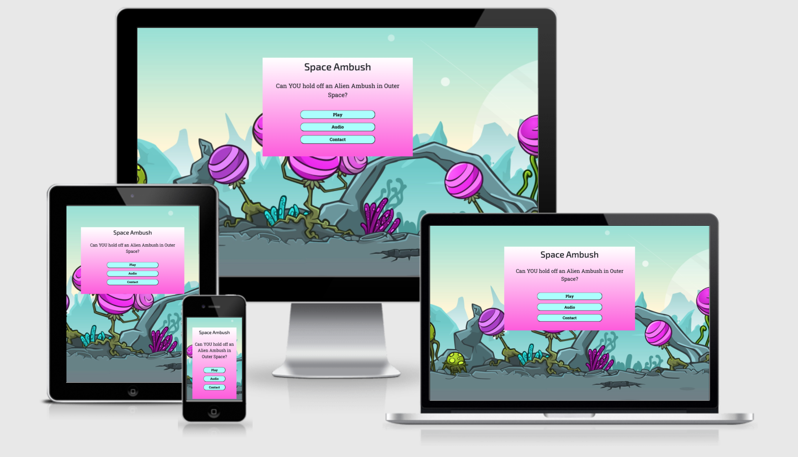
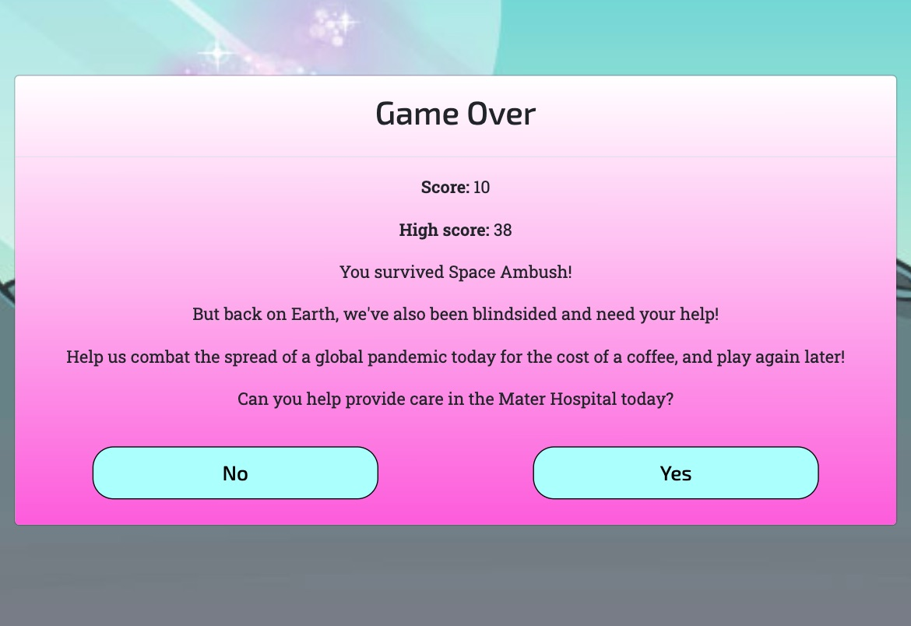

# Space Ambush Testing

In order for Space Ambush to be a successful mini game, its code was tested extensively across browsers and different device sizes.

<span id="top"></span>

## Index

1. [**Code Validation**](#code-validation)

2. [**Testing Against User Stories**](#testing-against-user-stories)

3. [**Manual Testing**](#manual-testing)
    - [**Responsive Design Testing**](#responsive-design-testing)
        - [**Overview**](#overview)
            - [**Game Main Menu**](#main-menu)
            - [**Audio Menu**](#audio-menu)
            - [**Game Over Menu**](#game-over-menu)
            - [**Game Area**](#game-area)

    - [**Functionality Testing**](#functionality-testing)
        - [**Game Functionality Testing**](#game-functionality-testing)
        - [**Ambush Functionality Testing**](#ambush-functionality)
        - [**Scoring Functionality Testing**](#scoring-functionality)
        - [**Game Over Functionality Testing**](#game-over-functionality)
        - [**Audio-Testing**](#audio-testing)

    
    - [**Google Dev tools - Lighthouse Audit**](#google-dev-tools---lighthouse-audit)
                    - [**Desktop Audit Result**](#desktop-audit-result)
                    - [**Mobile Audit Result**](#mobile-audit-result)

    - [**Additional Testing**](#additional-testing)

## Code Validation
<span id="code-validation"></span>

All code written has been thoroughly validated and passed through the following online validators:

- HTML - All code was run through the [W3C HTML Validator](https://validator.w3.org/) to ensure it was valid code and any errors flagged were fixed.

- CSS - All styling was run through the [W3C CSS Validator](https://jigsaw.w3.org/css-validator/) to ensure it was valid and any errors flagged were fixed.

- JavaScript - All my script was run through the [JSHint](https://jshint.com/) validator and any errors flagged were fixed.

<div align="right"><a style="text-align:right" href="#top">Return to index </a></div>

## Testing Against User Stories
<span id="testing-against-user-stories"></span>


Below I test each of the user stories listed in [README.md](https://github.com/DaithiShan/spaceambush/blob/master/README.md).

**As a first time visitor, I want to:**

1. See an appealing landing page, with clear, quick pathway to gameplay
  - The landing page of the website is brightly colored menu with big blue buttons, set against a vibrant alien planet.
  - All text elements indicate clear user pathways, and stand out clearly against their background colors
  - Level selection and tutorial information are pushed together concisely, allowing for quicker gaming




2. To quickly learn the controls, and how to toggle audio and quick exit
  - The controls are intuitive and outlined at level selection, and also are explained in the ingame help menu.
  - The user can select volume before game play, and toggle audio on and off in the game
  - A quick exit button provided in-game to bring the users back to the main menu


3. Intuitively grasp the scoring system, and understand how I win and lose points
  - The baseline score system is inline with expected behaviour from older Whack-A-Mole and video games
  - The score increments when the user clicks on a quickly appearing alien in time and emits a lasergun sound
  - The score reduces when an alien turns red, shoots and emits a lasergun sound
  - The scoring system also uses visual feedback, aliens clicked on turn yellow, and aliens shooting turn red first

**As a returning visitor, I want to:**

1. See my old score and beat it
  - Using local storage, the game retains a user's best ever score
  - This score is displayed in-game at the top of the screen and also in bold on the game-over menu



2. Choose higher difficulties, and experience genuinely harder gameplay
  - The baseline game is already harder than most Whack-A-Mole games, by using a retaliation mechanic
  - A higher difficulty is provided, adding an additional alien enemy with higher attack probability


3. Have an option to contact developers for any bugs, or for other feedback
  - The main menu to which the user returns after each game has a quick, contact form
  - The user is emailed a copy of their message after submission so they know it's been received


**As the charity benefiting from this mini game, I want to:**

1. Tie the game's premise to the charity mission after playthrough, without boring the player
  - After every game, the user is given a yes or no choice to donate to the charity
  - In the ask, the user is positioned as a space hero who can also save people on earth


2. Drive donations from players through the official charity website
  - If the user chooses to donate to The Mater Foundation, they're redirected to the official donation form

3. Capture useful feedback including bug reports and feature suggestions
  - The main menu contains a contact form for players to leave feedback
  - The text element prompts bug reports and user suggestions specifically

  <div align="right"><a style="text-align:right" href="#top">Return to index </a></div>

## Manual Testing
<span id="manual-testing"></span>

I have detailed the manual testing undertaken during the development stage to try reduce any bugs, and make sure the game play delivers as intended.


### Responsive Design Testing
<span id="responsive-design-testing"></span>

All testing was performed using:

- Google Chrome
- Microsoft Edge
- Mozilla Firefox
- Safari
- Desktop
- Mobile Phones - All emulated devices offered in Google Dev Tools as well as friends devices.
- Tablets - All emulated devices offered in Google Dev Tools as well as parents devices.

#### Overview
<span id="overview"></span>

This game was intended to be responsive on all devices such as mobile phones, tablets, desktops.

To ensure the site and game board remains responsive, I tested the layout at every stage of development on the various screen sizes within the Chrome Dev tools and corrected the styling of the elements and added Media Queries so that the design will adjust to device being viewed.

This was particularly challenging given the irregular sizes of the game's main assets ; the alien bushes and the alien ambushers. 

I needed to use a blend of general and targeted css, as well as multiple media queries, to try and deliver the same experience.

##### Game Main Menu
<span id="game-main-menu"></span>

  - Bug Identified - **Main Menu Positioning**

    - Initially, I used a mix of absolute position and left + top properties to fix where the main menu would sit. This was an error, but thankfully I had help from my mentor in fixing it.


  - Fix Applied:

   - The bug in positioning was fixed by abandoning an overly complicated positioning strategy. I removed the use of absolute positioning, and relied instead on just top positioning + automatic margin.


##### Audio Menu
<span id="audio-menu"></span>

- Bug Identified - **Audio Menu Button Icons Not Centred on Mobile**

  - When I asked my friends to test different aspects of the game, one of the user tasks I gave was to open the different modals on their devices. The emulations accessed via Chrome Dev Tools don't always show the errors that can display on physical device. One area that this proved true was that the volume icons on the audio menu weren't centred on screens smaller than 600px!


- Fix Applied:

  - This was one of those minor bugs that actually take a while to fix. I first tried adding text-center to the parent element (the buttons) and then tried adding center to the icon classes (recommended). Then I tried using min-width, and after that max-width. Eventually I changed the actual size of the element to 10px larger than original, and it fixed it!

##### Game Over Menu
<span id="game-over-menu"></span>

  - Bug Identified - **Game Over Menu Responsiveness**

    - The game over menu was another challenge. Originally, I used the fit-content property of height and width. However this caused problems on mobile display. Additionally, I used fixed values for the button margins.

  - Fix Applied:

   - The fix applied here was similar to how I improved responsiveness in other areas. Instead of using fixed values, I tested auto values for width and height using Google Chrome Dev Tools. The improvement was immediately evident.

##### Game Page
<span id="game-page"></span>

- Bug Identified - **Accidental Double Zoom on Game Area When Trying to Tap on Aliens**

  - This bug was probably the most frustrating for users initially, from their feedback. When users tried to quickly tap on the aliens ambushers after they popped from behind the bushes, they accidentally double zoomed in on the game area.

- Fix Applied

  - I tried a few different fixes. But the most effective was simply adding the following CSS to the top level body DOM element

  ```
  body{
      touch-event: manipulation;
  }
  ```

<div align="right"><a style="text-align:right" href="#top">Return to index </a></div>

### Functionality Testing
<span id="functionality-testing"></span>

#### Game Functionality Testing
<span id="game-functionality"></span>

The game play is a combination of the most important features, and my priority was to make sure that it delivered an excellent experience regardless of device or browser.

I identified the main bugs with the help of my friends, who used different tablet and mobile devices primarily, but I was able to test off a desktop computer.

#### Ambush Functionality Testing
<span id="ambush-functionality"></span>

- Bug Discovered - **Aliens Freezing in Up position on Click/Tap**

  - This was one of the most immediately obvious bugs from friends testing the game. The aliens would pop out and ambush the user. And then the aliens would normally hide again using a basic setTimeout. But if the user kept clicking on the alien, they would freeze in an Up position.


- Fix Applied:

  - I added a simple CSS effect to my whackAlienOne and smackAlienTwo functions, which made sure that the aliens went back behind the plants after you tapped or clicked on them. This functionality runs in addition to the basic setTimeout for the Up position, as the aliens still need to pop in and out even if you completely ignore them.

#### Scoring Functionality Testing
<span id="scoring-functionality"></span>

- Bug Discovered - **Cheat Scores by Furious Tapping/Clicking**

  - This was the most SATISFYING of all bugs to SQUASH. 
  
  - Even with the identification and fix of the CSS bug above, some of my friends were still able to cheat the game. They would tap very quickly on the aliens multiple times before the new CSS fix above could be applied. The result is they would score multiple points on a single attack.

  - In order to keep the visual effect of the alien turning yellow after being shot, I did not want the alien to disappear immediately on being clicked. 
  
  - My original goal had been to make sure the alien did not freeze on Up. I did not to disappear the alien before the nice visual feedback of the alien turning yellow on being attacked!


- Fix Applied:

  - I added isWhacked = False / True as a boolean value to every alien within my ambush() and whackAlienOne/smackAlienTwo functions.

  - I set the value to true after every tap or click on an alien. 
  
  - Then I reset the values to false within ambush before function told the aliens to pop out again. 
  
  - I can't describe how satisfied I was to discover this fix by myself, and eliminate the insanely high scores of some of the cheating testers!

```
function whackAlienOne(e) {
    if(!this.isWhacked){
    clickSound();
    score ++;
    }
    this.style.pointerEvent = "none";
    this.style.backgroundImage = "url(../assets/images/game-assets/alien-one-yellow.svg)";
    setTimeout (()=> {
        this.parentNode.classList.remove('up');
    }, 500);
  setTimeout(() => {
    this.style.backgroundImage = "url(../assets/images/game-assets/alien-one.svg)";
    this.style.pointerEvent = "all";
  }, 510);
  scoreDisplay.textContent = score;
  return this.isWhacked = true;
}
```

#### Game Over Functionality Testing
<span id="game-over-functionality"></span>

- Bug Discovered - **Game Over Menu Called Twice**

  - This was the second most satisfying bug to squash. It took me 3 days to identify it, as I searched in the wrong area.

  - The game timer runs on an interval function. However, when the user tapped on the in-game exit button and returned to the main screen, the game over function would call again after the remaining time left in their previous game had elapsed.

  - Initially, I thought I was doing something wrong in the setInterval function.

- Fix Applied:

  - I had two functions running to carry out identical tests. One was a setTimeout function that combined with an if statement to gauge when to call gameOver() and the other was the aforementioned setInterval function. I removed the setTimeout function, and this squashed the bug.

### Audio Testing
<span id="audio-testing"></span>

1. **Click Sound Effect Function**

    - I tested that the click sound is called whenever the user selects a menu option, and whenever he shoots an alien. I've also tested that it calls whenever an alien attacks.

    - I've had to cut the sound a few times to make sure that it can be called at very short intervals.

    - I tested that the function does not play when the volume has been muted and that it plays at corresponding level that the Sound Effect slider is set at.

    - No bugs were discovered with this function.

2. **Game Over Sound Function**

    - I tested that the function gets called once the level has been completed and gameOverLaunch() has been launched.

    - No bugs were discovered with this function.
    
3. **Game Music**

    - I tested that the function gets called at the start of a game and stops playing the moment the user exits the game.

    - The original audio for the game music was quite long, and so it had a build for the first 30 seconds.

    - My solution was to edit out a clip of 30 seconds for game play.

    - I kept a slightly longer music clip as test audio for when the user adjusts their audio. Just in case they spend longer than 30 seconds on the menu, so that their loop isn't too short. 

        - Bug Discovered:

            - Originally this created a bug where two types of game music were playing at the start of the game.
        
        - Fix Applied

            -  I created a function called stopMenuMusic() to handle this bug.
        
        - Bug Discovered:

            - The longer clip was too long, and affected the effective cache policy for desktop.
        
        - Fix Applied

            -  I further shortened the clip to 1.37 seconds.

<div align="right"><a style="text-align:right" href="#top">Return to index </a></div>

#### Google Dev tools - Lighthouse Audit
<span id="google-dev-tools--lighthouse-audit"></span>

The below screenshots have been taken use the Google Chrome Dev Tools Lighthouse Audit functionality 

#### Desktop Audit Result
<span id="desktop-audit-result"></span>


#### Mobile Audit Result
<span id="mobile-audit-result"></span>


### Additional Testing
<span id="additional-testing"></span>

I asked all my friends and family to play on their devices. This was extremely helpful in supplementing my own testing!